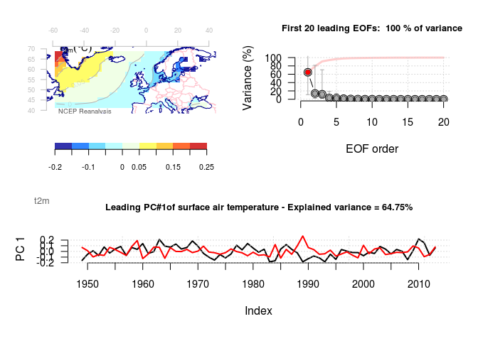
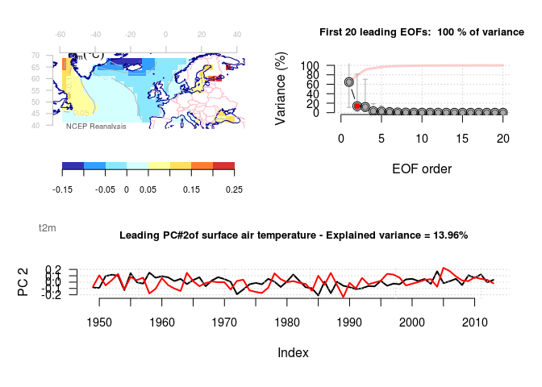
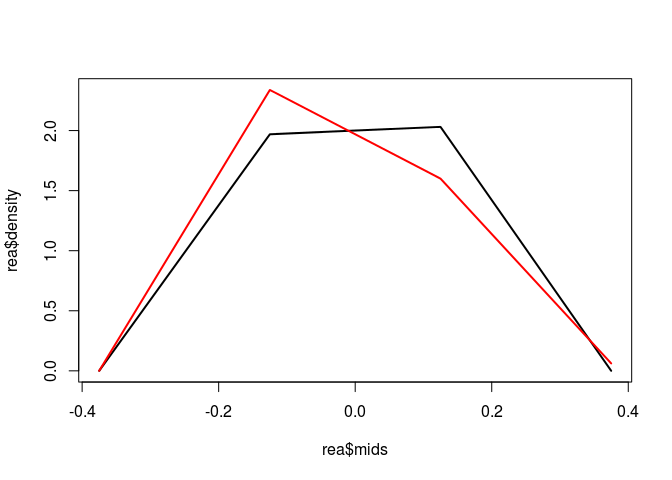
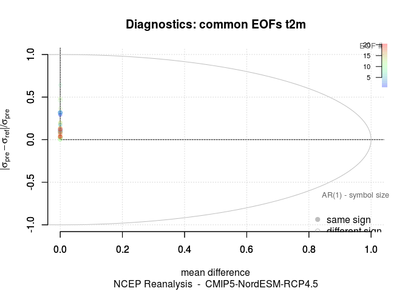

Common EOFs
================
Rasmus Benestad
April 28, 2016

Comparing spatial-temporal structures of variability
----------------------------------------------------

Common principal component analysis (PCA) and empirical orthogonal functions (EOFs) can be used to compare and analyse co-variance structures in multi-dimensional data. This is an R Markdown document which provides a demonstration of the concept. Markdown is a simple formatting syntax for authoring HTML, PDF, and MS Word documents. For more details on using R Markdown see <http://rmarkdown.rstudio.com>.

*Sample data*
-------------

Here we use the R-package 'esd' <https://github.com/metno/esd> and sample data which come with this analysis tool. Note that the data are filtered and only describe large-scale features. Hence, it is ok for demonstration purposes, but true results need to be based on the raw temperatures.

Here we want to compare characteristical patterns of variability in marine tsurface temperatures associated with the winter season.

``` r
library(esd)
X1 <- mask(t2m.NCEP(lon=c(-60,40),lat=c(40,70)),land=TRUE)
X2 <- t2m.NorESM.M(lon=c(-60,40),lat=c(40,70))
X2 <- subset(X2,it=range(index(X1)))
```

We limit the demonstration to the winter season.

``` r
X1 <- subset(as.4seasons(X1),it='Jan')
X2 <- subset(as.4seasons(X2),it='Jan')
```

Common EOFs (PCAs) are combuted by constructing a data matrix containing anomalies from different sources, interpolated to a common spatial grid.

``` r
XX <- combine(X1,X2)
```

The EOFs are then computed as in traditional sense, but differ only by the input, which now is a matrix of combined data. The spatial pattern (EOF) now represents both the reanalysis and the GCM, and it is only in the principal components (PCs) where we will find the differences between the two.

``` r
ceof <- EOF(XX)
plot(ceof)
```

<!-- -->

The results suggest that there are two leading modes which account for most of the variance. We can also inspect the second mode.

``` r
plot(ceof,pattern=2)
```

<!-- -->

To study similarities and differences between the reanalysis and the GCM, we need compare the statistics in the PCs. Below is a a plot with historgrams for the leading PC for both data sets:

``` r
breaks <- seq(-0.5,0.5,by=0.25)
gcm <- hist(attr(ceof,'appendix.1')[,1],breaks=breaks,plot=FALSE)
rea <- hist(ceof[,1],breaks=breaks,plot=FALSE)
plot(rea$mids,rea$density,type='l',lwd=2,ylim=range(rea$density,gcm$density))
lines(gcm$mids,gcm$density,lwd=2,col='red')
```

<!-- -->

We can apply statistical tests, like the Students t-test.

``` r
print(t.test(coredata(ceof[,1]),coredata(attr(ceof,'appendix.1')[,1])))
```

    ## 
    ##  Welch Two Sample t-test
    ## 
    ## data:  coredata(ceof[, 1]) and coredata(attr(ceof, "appendix.1")[, 1])
    ## t = 0, df = 120.383, p-value = 1
    ## alternative hypothesis: true difference in means is not equal to 0
    ## 95 percent confidence interval:
    ##  -0.03069652  0.03069652
    ## sample estimates:
    ##     mean of x     mean of y 
    ## -8.949620e-18  4.810105e-18

There is also a more fancy diagnostic infographics for common EOFs in esd, which indicates the differences in terms of mean, standard deviation, and autocorrelation. An example is given below where the colour of the symbols indicate the EOF rank (only the blue ones are important) and the symbol size the ratio of the auto-correlation (small ones indicate .

``` r
plot(diagnose(ceof),new=FALSE)
```

<!-- -->
