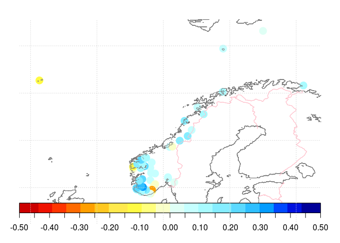
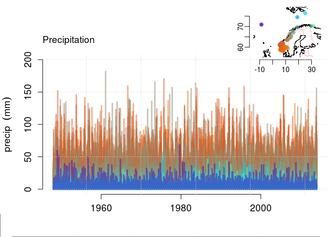
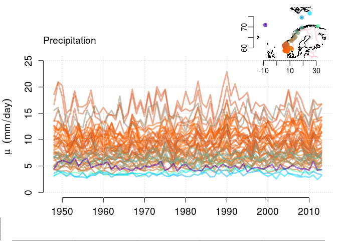
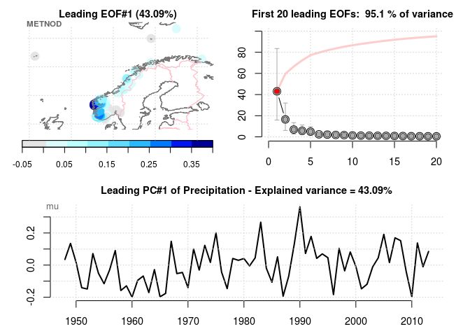

PCA4station-data-inspection
================
Rasmus Benestad
April 29, 2016

Quality of station data
-----------------------

We want to look at a group of station data and test a strategy for assessing data quality. This is an R Markdown document. Markdown is a simple formatting syntax for authoring HTML, PDF, and MS Word documents. For more details on using R Markdown see <http://rmarkdown.rstudio.com>.

**Station data**
----------------

Get some data to play with.

``` r
library(esd)
library(utils)
if (!file.exists('precip.norway.rda')) download.file('https://ndownloader.figshare.com/files/2155751','precip.norway.rda')
load('precip.norway.rda')
## The precipitation data is 'Pr'
```

Now inspect the data - check for missing values

``` r
diagnose(Pr)
```

<!-- -->

Estimate annual aggregates:

``` r
mu <- annual(Pr,'wetmean')
fw <- annual(Pr,'wetfreq')
map(mu,FUN='trend',new=FALSE)
```

<!-- -->

Plot the original daily data

``` r
plot(Pr,new=FALSE)
```

<!-- -->

The wet-day mean precipitation \(\mu\)

``` r
plot(mu,new=FALSE)
```

<!-- -->

The wet-day frequency \(f_w\)

``` r
plot(fw,new=FALSE)
```

<!-- -->

Apply a principal component analysis (PCA) to the annual aggregates:

``` r
pca.mu <- PCA(mu)
pca.fw <- PCA(fw)
```

Plot the leading PCA mode

``` r
plot(pca.mu,new=FALSE)
```

    ## Warning in plot.xy(xy.coords(x, y), type = type, ...): "plot" is not a
    ## graphical parameter

<!-- -->

Take a copy of the original data and mess it up by introducing deliberate errors and artifacts to degrade the information embedded. The idea is to explore the ways such errors affect the end result.

``` r
X <- Pr
## Degrade the original data by synthetically introducing of errors and problems
d <- dim(X)
## Indices with values set to zero
s20.1 <- sample(1:d[1],1000); s20.2 <- sample(1:d[2],10)
## Indices with values set to random
s2r.1 <- sample(1:d[1],1000); s2r.2 <- sample(1:d[2],10)
## Set a random sub-selection of data points to zero or random values
X[s20.1,s20.2] <- 0
X[s2r.1,s2r.2] <- rexp(10000,rate=0.001)
## Set some locations to bad values
S2R <- sample(1:d[2],3)
X[,S2R] <- rexp(d[1],rate=c(1,0.1,0.5))
```

Estimate synthetic annual aggregates for \(\mu\) and \(f_w\).

``` r
mu.s <- annual(X,'wetmean')
fw.s <- annual(X,'wetfreq')
map(mu,FUN='trend',new=FALSE)
```

<!-- -->

``` r
plot(X,new=FALSE)
```

<!-- -->

``` r
plot(mu.s,new=FALSE)
```

<!-- -->

``` r
plot(fw.s,new=FALSE)
```

<!-- -->

``` r
pca.smu <- PCA(mu.s)
pca.sfw <- PCA(fw.s)
```

``` r
plot(pca.smu,new=FALSE)
```

    ## Warning in plot.xy(xy.coords(x, y), type = type, ...): "plot" is not a
    ## graphical parameter

<!-- -->
