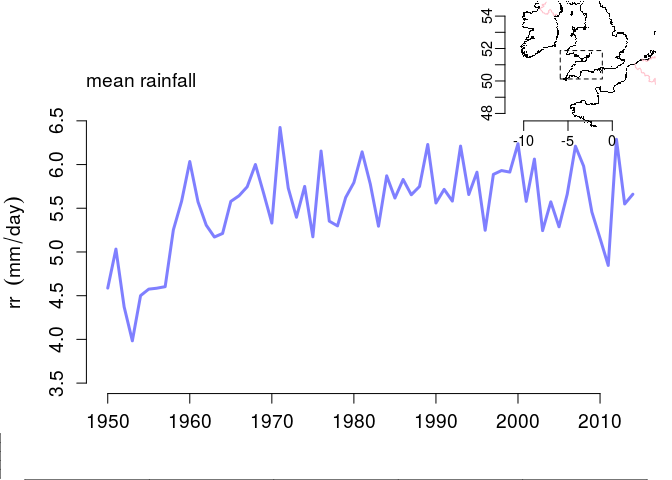
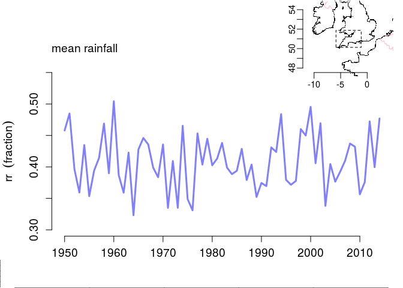
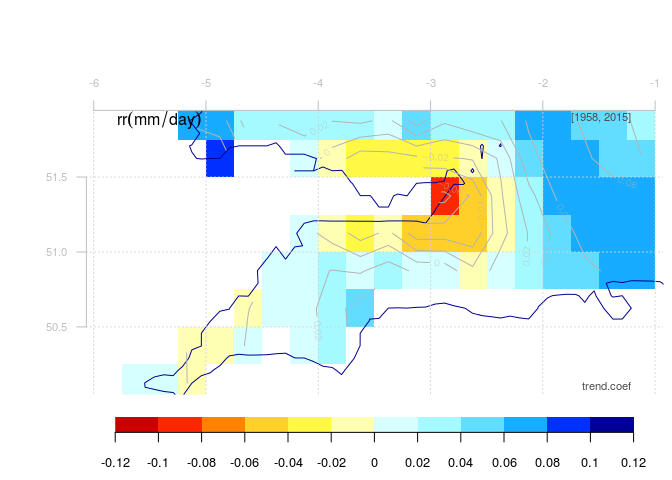
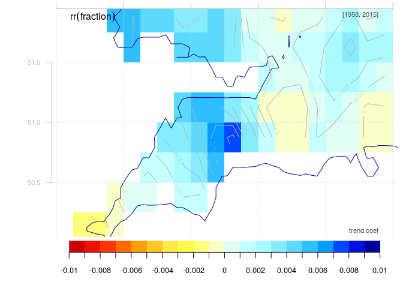
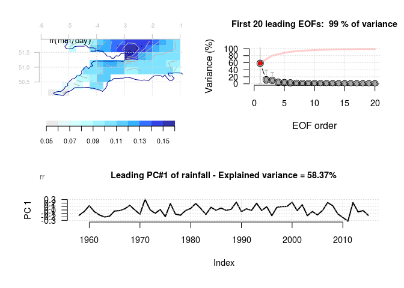
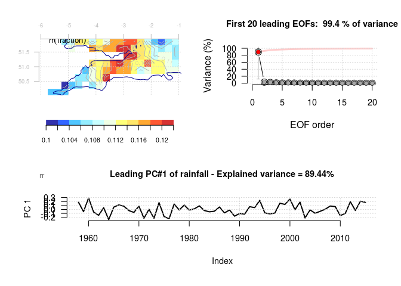
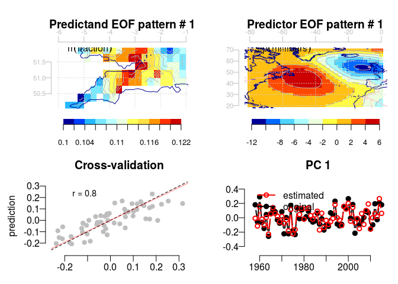
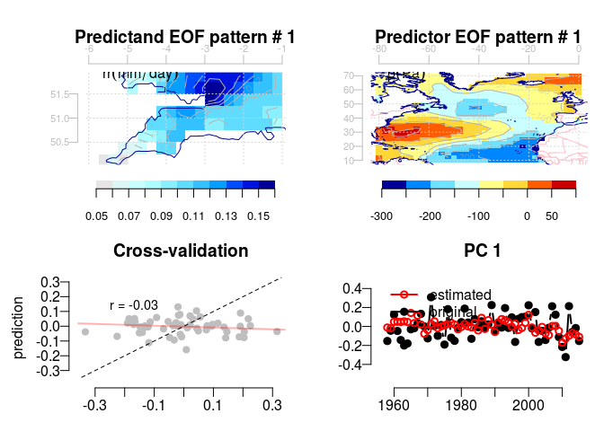

eu-circle-torbay-precip.Rmd
================
Rasmus Benestad
April 18, 2016

R Markdown
----------

This is an R Markdown document. Markdown is a simple formatting syntax for authoring HTML, PDF, and MS Word documents. For more details on using R Markdown see <http://rmarkdown.rstudio.com>.

This script retreives precipitation for Southwestern England from the EOBS data set and estimates the wet-day mean precipitation and frequency.

The EOBS data was chosen here because the rain gauge data from stations (MIDAS) was intermittent and not readily available for an analysis that makes use of PCA in order to make the most use of the information embedded in many parallel data records.

Rain gauges provide a very tiny sample of the rainfall, and previous work suggests that downscaling can provide a better picture if it's applied to a group of stations rather than single stations (Benestad et al., 2015; <doi:10.342/tellusa.v67.28326>). Downscaling applied to products from principal component analysis (PCA) benefits from an emphasis on cohernt structure of variability in time and space, which can improve the signal-to-noise ratio. PCA requires no missing values, but the EOBS gridded data provides complete records.

``` r
library(esd)
pr.eobs <- retrieve('data.ECAD/rr_0.25deg_reg_v12.0.nc',lon=c(-6,-1),lat=c(50,52))
mu <- annual(pr.eobs,FUN='wetmean')
fw <- annual(pr.eobs,FUN='wetfreq')
```

Past trends
-----------

Climate change has taken place for some time, and past trends may provide some indication about whether a chosen climate parameter such as the wet-day mean precipitation \(\mu\) or wet-day frequency \(f_w\) are sensitive to a global warming:

``` r
## The area mean wet-day mean precipitation
plot(mu,new=FALSE)
```

<!-- -->

``` r
## The area mean wet-day frequency
plot(fw,new=FALSE)
```

<!-- -->

``` r
## The early part of the record looks suspect:
mu <- subset(mu,it=c(1958,2015))
fw <- subset(fw,it=c(1958,2015))
## Show maps of trends for the wet-day mean precipitation
map(mu,FUN='trend',
    colbar=list(breaks=seq(-0.12,0.12,by=0.02),pal='t2m',rev=TRUE))
```

<!-- -->

``` r
## Map of trends in wet-day frequency:
map(fw,FUN='trend',
    colbar=list(breaks=seq(-0.01,0.01,by=0.001),pal='t2m',rev=TRUE))
```

<!-- -->

The trend analysis for the wet-day frequency suggest a general increase in the number of wet-days over the perdiod 1960--2015 while the intencity .

The predictors can be organised as EOFs to simplify the analysis and make use of properties as the products being orthogonal. Here are the EOFS for the annual wet-day mean precipitation \(\mu\)

``` r
## The area mean wet-day mean precipitation
eof.mu <- EOF(mu)
## The area mean wet-day frequency
plot(eof.mu)
```

<!-- -->

and the annual wet-day frequency \(f_w\)

``` r
## Show maps of trends for the wet-day mean precipitation
eof.fw <- EOF(fw)
## Map of trends in wet-day frequency:
plot(eof.fw)
```

<!-- -->

The diagnostics of the EOFs suggest that the leading mode explains a high proportion of the variability on an annual time scale.

The mean sea-level pressure (SLP) is used as predictor for the annual wet-day frequency, as this gives a good description of the circulation. A number of different spatial domains were tested, and for SLP and \(f_w\), the results were fairly robust with respect to the choice of domain.

The predictor for the wet-day mean precipitation was taken to be the saturation vapour pressure over the North Atlantic, which is regarded as the main source for the atmospheric moisture over northern Europe.

Predictor
---------

``` r
## The mean sea-level pressure
slp <- retrieve('slp.mon.mean.nc',lon=c(-80,0),lat=c(20,70))
```

    ## [1] "Warning : Calendar attribute has not been found in the meta data and will be set automatically."

``` r
## The surface temperature
t2m <- retrieve('air.mon.mean.nc',lon=c(-80,0),lat=c(10,70))
```

    ## [1] "Warning : Calendar attribute has not been found in the meta data and will be set automatically."

``` r
## Saturation water pressure estimated from maritime temperatures
es <- C.C.eq(mask(t2m,land=TRUE))
eof.slp<- EOF(annual(slp))
eof.t2m <- EOF(annual(t2m))
eof.es <- EOF(annual(es,FUN='mean'))
```

Cannical Correlation analysis
-----------------------------

Carry out canonical correlation analysis (CCA) to explore relationships between the large-scale conditions such as SLP/temperature and the precipitation over soutwestern England:

``` r
## The wet-day frequency and SLP
cca.fw <- CCA(eof.fw,eof.slp)
```

    ## [1] "CCA.eof"
    ## [1] "Barnett-Preisendorfer CCA"

``` r
plot(cca.fw)
cca.mu <- CCA(eof.mu,eof.es)
```

    ## [1] "CCA.eof"
    ## [1] "Barnett-Preisendorfer CCA"

``` r
plot(cca.mu)
```

The CCA identifies the two patterns in the data that have the highest correlation - this pattern may not necessarily be the ones with the highest variance.

Downscaling analysis
--------------------

The downscaling emplies a multiple regression applied to each of the principal components for the EOFs of \(\mu\) and \(f_w\).

``` r
## The wet-day frequency and SLP
ds.fw <- DS(subset(eof.fw,pattern=1:4),eof.slp,eofs=1:5)
```

    ## 
      |                                                                       
      |                                                                 |   0%
      |                                                                       
      |================                                                 |  25%
      |                                                                       
      |================================                                 |  50%
      |                                                                       
      |=================================================                |  75%
      |                                                                       
      |=================================================================| 100%

``` r
plot(ds.fw)
```

<!-- -->

    ## NULL

``` r
ds.mu <- DS(subset(eof.mu,pattern=1:4),eof.es,eofs=1:7)
```

    ## 
      |                                                                       
      |                                                                 |   0%
      |                                                                       
      |================                                                 |  25%
      |                                                                       
      |================================                                 |  50%
      |                                                                       
      |=================================================                |  75%
      |                                                                       
      |=================================================================| 100%

``` r
plot(ds.mu)
```

<!-- -->

    ## NULL

The downscaling includes cross-validation analysis, and the results shown are for the leading EOF of the predictands. We do not expect that the downscaling will capture a large fraction of the wet-day mean precipitation; local processes are also likely influencing.

Extract the residual and examine to see if there is any temporal-stpatial structure left: a tell-tale sign for noise is a flat eigenspectrum

``` r
## The residual of the wet-day precipitation
z.mu <- as.field(ds.mu)
#res.mu <- as.residual(z.mu)
res.mu <- mu - z.mu
res.mu <- attrcp(mu,res.mu)
class(res.mu) <- class(mu)
eof.res.mu <- EOF(res.mu)
plot(eof.res.mu)
```

<!-- -->

For comparison the original data look like this:

``` r
## The residual of the wet-day precipitation
plot(EOF(mu))
```

<!-- -->

``` r
## Repeat with the wet-day frequency for the benefit of comparison
z.fw <- as.field(ds.fw)
#res.fw <- as.residual(ds.fw)
## Another way to estimate the residuals:
res.fw <- fw - z.fw
res.fw <- attrcp(fw,res.fw)
class(res.fw) <- class(fw)
eof.res.fw <- EOF(res.fw)
plot(eof.res.fw)
```

<!-- -->

For comparison the original data look like this:

``` r
## The residual of the wet-day precipitation
plot(EOF(fw))
```

<!-- -->

Hence, there is remaining spatio-temporal structure left in the residuals from the downscaling. The challenge is to identify further factors on which both the wet-day mean precipitation and the wet-day frequency depend. It's surprising to see such strong modes in the residual of the wet-day frequency still.
