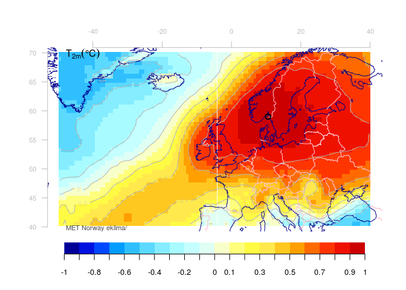
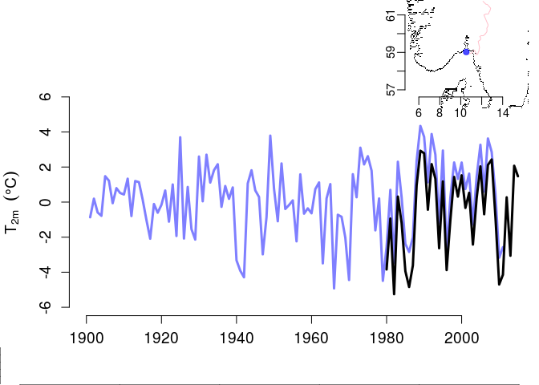
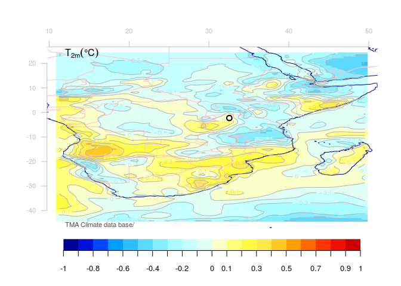
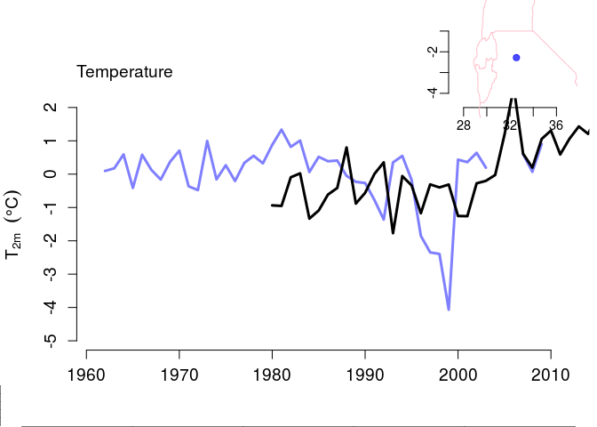
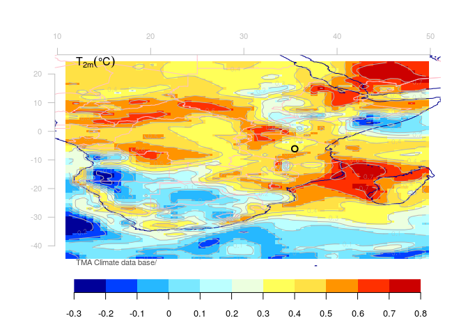
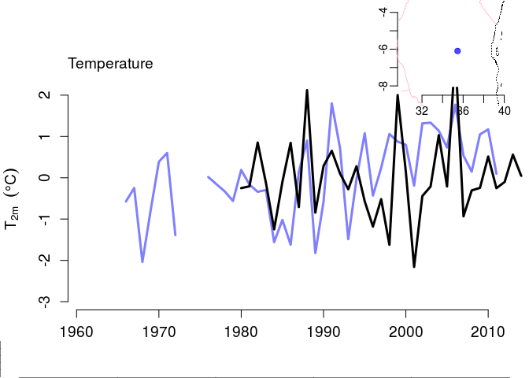

Habiba
================
Rasmus Benestad
April 29, 2016

R Markdown
----------

This is an R Markdown document. Markdown is a simple formatting syntax for authoring HTML, PDF, and MS Word documents. For more details on using R Markdown see <http://rmarkdown.rstudio.com>.

Load the esd-package and the data:

``` r
library(esd)
load('tmininTz.rda')
load('predictors.rda')
data(ferder)
```

This is what we expect to see with good correspondence between predictand and predictor

``` r
djf.e <- subset(as.4seasons(ferder),it='Jan')
corfield(djf.e,DJF.E,colbar=list(rev=FALSE),new=FALSE)
```

<!-- -->

Now compare the station data with the corresponding interpolated data from the reanalysis

``` r
dje.ei <- regrid(DJF.E,is=djf.e)
plot(djf.e,new=FALSE)
lines(dje.ei,lwd=3)
```

<!-- -->

**Tanzania**
------------

Now we have a look at some of the stations in Tanzania: the ones with the poorest and the best score for the season with the lowest score. The first one is for Mwanza December-February mean daily minimum temperature:

``` r
y <- subset(Y,is='Mwanza')
djf <- subset(as.4seasons(y),it='Jan')
## fix a little bug
attr(djf,'unit') <- 'degC'
corfield(djf,DJF,colbar=list(rev=FALSE),new=FALSE)
```

<!-- -->

We can interpolate temperatures for the same coordinate as for Mwanza, but when we do the comparison, we need to use standardised values as the predictor represents the mean of daily mean temperatures \(\overline{T}\) whereas the station is the mean daily minimum \(T[min]\):

``` r
djf.i <- regrid(DJF,is=y)
plot(stand(djf),new=FALSE)
lines(stand(djf.i),lwd=3)     
```

<!-- -->

Dodoma was the station with the best correspondence between predictor and predictand:

``` r
y2 <- subset(Y,is='Dodoma')
## There were two entries for Dodoma - exclude the one from GHCN
y2 <- subset(y2,is=1)
djf2 <- subset(as.4seasons(y2),it='Jan')
## fix a little bug
attr(djf2,'unit') <- 'degC'
corfield(djf2,DJF,colbar=list(rev=FALSE),new=FALSE)
```

<!-- -->

``` r
djf.i2 <- regrid(DJF,is=y2)
plot(stand(djf2),new=FALSE)
lines(stand(djf.i2),lwd=3)     
```

<!-- -->
